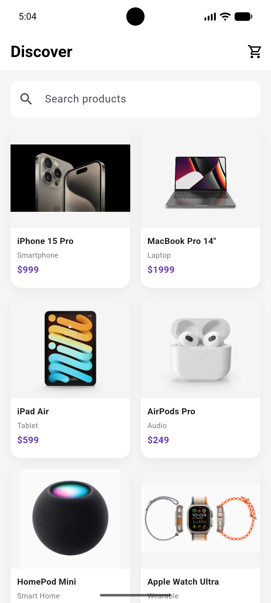
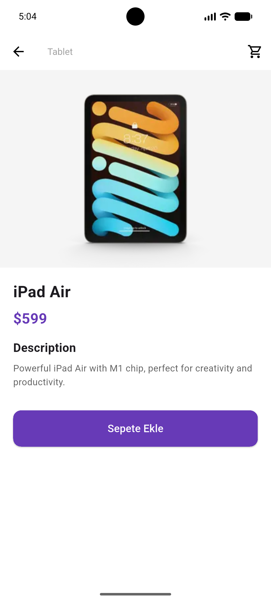
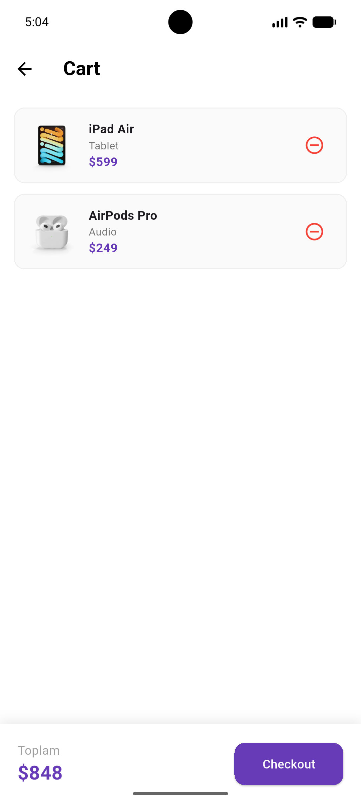

# 🛍️ Mini Katalog Uygulaması

Flutter ile geliştirilmiş, modern ve kullanıcı dostu bir ürün katalog uygulaması.

## 📱 Ekran Görüntüleri

| Ana Sayfa | Ürün Detayı | Sepet |
|-----------|-------------|-------|
|  |  |  |

## ✨ Özellikler

- 🔍 Ürün arama ve filtreleme
- �� GridView ile ürün listeleme
- 📄 Ürün detay sayfası
- 🛒 Sepet sistemi (ürün ekleme, çıkarma, checkout)
- 🔀 Sayfa geçişleri (Named Routes + Route Arguments)
- 💜 Modern ve temiz UI tasarımı

## 🛠️ Kullanılan Teknolojiler

- Flutter 3.41.7
- Dart
- Material Design 3

## 📁 Proje Yapısı

```
lib/
├── main.dart
├── models/
│   ├── product.dart
│   └── product_data.dart
├── screens/
│   ├── home_screen.dart
│   ├── detail_screen.dart
│   └── cart_screen.dart
└── widgets/
    └── product_card.dart
```
## 🚀 Çalıştırma Adımları

1. Flutter SDK kurulu olmalıdır
2. Repoyu klonlayın:
   git clone https://github.com/dolunayozbilgin/mini-katalog.git
3. Proje klasörüne girin:
   cd mini-katalog
4. Bağımlılıkları yükleyin:
   flutter pub get
5. Uygulamayı çalıştırın:
   flutter run

## 📋 Gereksinimler

- Flutter SDK 3.0+
- Dart SDK
- Android Studio (Emulator için)
- VS Code
